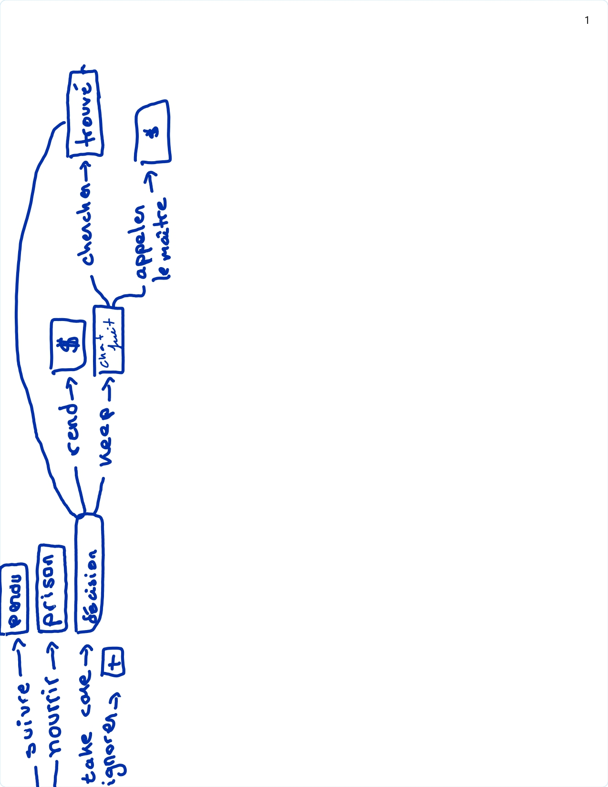
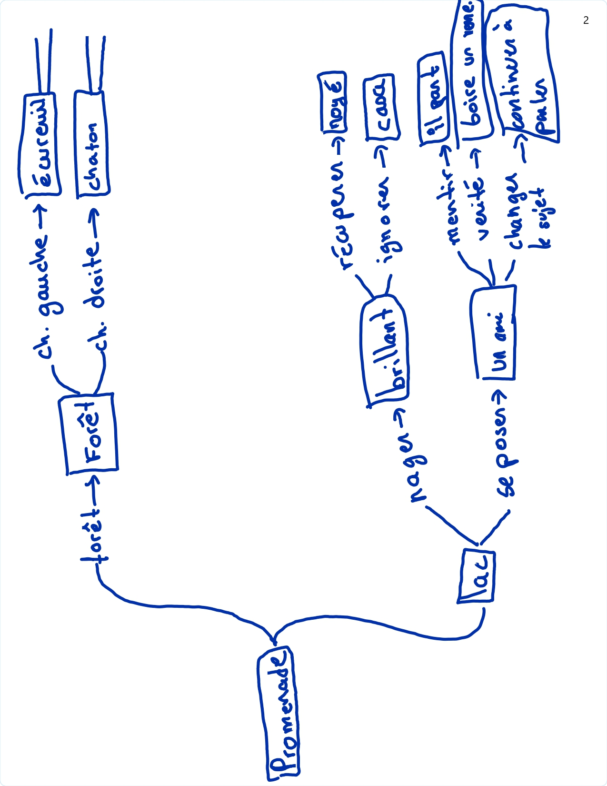

| Tâche        |Temps estimé|  Temps passé | Commentaire                    |
| ------------ | ---|-------- | ------------------------------ |
| Estimation |5min |6min          |                                |
| Une aventure | 1h20min|   2h35min | J'ai mis "il" à la place de "li", pip installé dans un dossier qui n'est pas inclus dans la variable d'environnement "PATH", difficile à comprendre l'erreur lorsque test "failed" s'affiche (je me suis beaucoup aidé de chatgpt) |
| Votre aventure| 1h30min| 3h25min| pas d'imagination                          |
| Total        | 2h55min|   6h06min    |                                |

